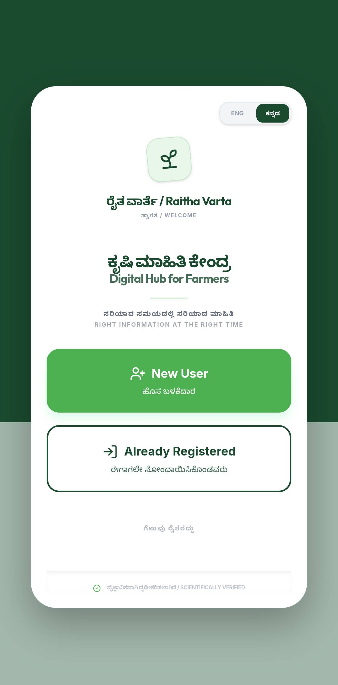
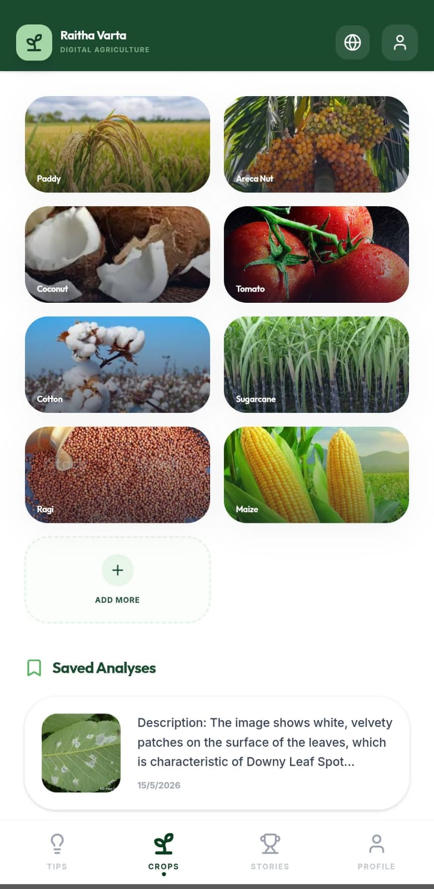
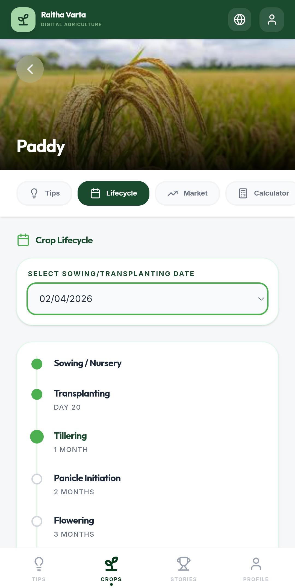
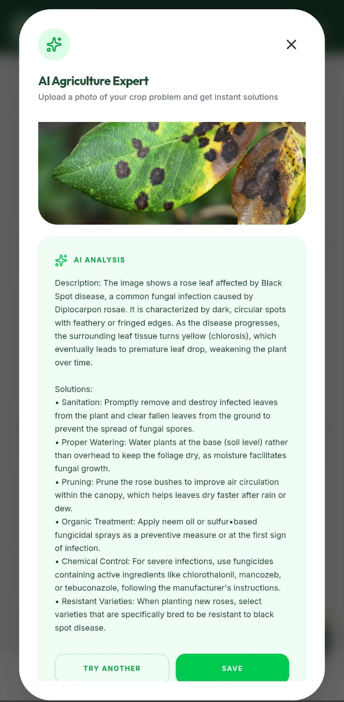
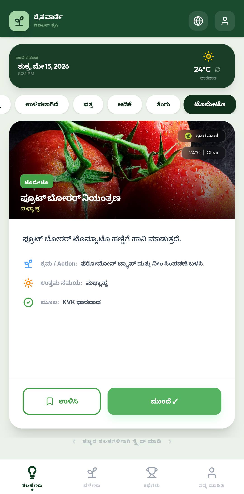
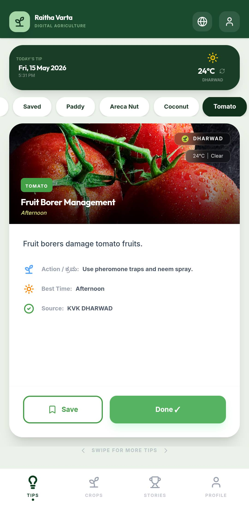
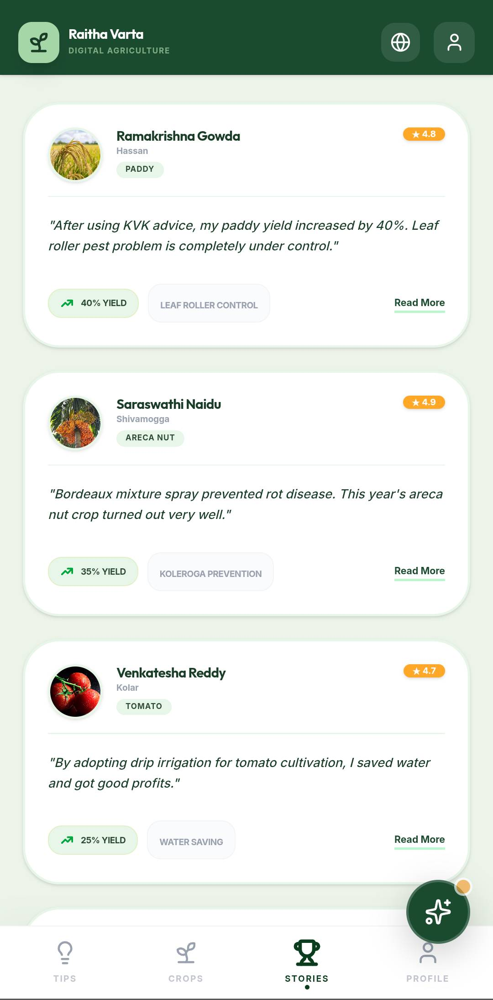
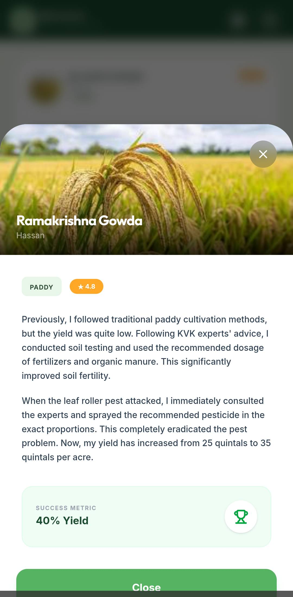

# 🌾 Raitha-Varta
### Smart Agriculture Advisory Platform for Farmers

Raitha-Varta is an AI-powered agriculture advisory platform that delivers simple, actionable farming guidance through daily advisory cards — tailored to crop type, weather conditions, and farming practices.

---

## Features

| Feature | Description |
|--------|-------------|
| Daily Advisory Cards | Swipeable, short, crop-specific farming tips |
| Crop Support | Paddy, Areca Nut, Coconut, Tomato, Maize |
| AI Assistance | Smart guidance powered by Gemini API |
| Multilingual | Kannada & English |
| Expert Ask | Simulated expert consultation with image upload |
| Success Stories | Real farmer case studies and outcomes |
| Android APK | Mobile app via Capacitor & Android Studio |

---

## Tech Stack

| Category | Technologies |
|----------|-------------|
| Frontend | kotlin, React, Vite, TypeScript |
| Mobile | Capacitor Android |
| Backend | Firebase ,Room database gor offline storage|
| AI | Gemini API |
| Build Tools | Android Studio, Gradle, Android SDK 34 |

---

## Requirements

- Node.js v18+, npm
- Java JDK 21
- Android Studio + Android SDK 34
- Git

---

## Setup

```bash
# Clone & install
git clone [YOUR_REPOSITORY_URL]
cd [YOUR_PROJECT_DIRECTORY]
npm install

# Add environment variable
echo "VITE_GEMINI_API_KEY=your_key_here" > .env

# Start dev server
npm run dev
```

> **Note:** Never commit `.env` or Firebase credentials. Add them to `.gitignore`.

---

## Android Build

```bash
npm run build
npx cap sync android
```

Open the `android/` folder in Android Studio and wait for Gradle sync, then:

- **Debug APK:** Build → Build APK(s)
  Output: `android/app/build/outputs/apk/debug/app-debug.apk`

- **Release APK:** Build → Generate Signed Bundle / APK → Select Keystore

Set your SDK path in `android/local.properties`:

```properties
sdk.dir=C:\Users\YourName\AppData\Local\Android\Sdk
```

**Required SDK components:** Android SDK 34, Build Tools 34.0.0, Platform Tools

---

## Security

The following must never be committed or publicly exposed:

- `.env`
- Firebase credentials
- `local.properties`

---

## Upcoming

Real-time weather · Offline support · AI pest detection · Voice assistance · Marketplace · Government schemes · Farmer community

---

## Vision

Raitha-Varta modernizes agricultural advisory by combining AI, multilingual support, and mobile technology — putting practical farming knowledge in every farmer's hands.
# App Screenshots

## Opening Page


## Login Page


## Crops Page


## Crop Details


## AI Solution


## Tips Page


## Tips Page 2


## Farmer Stories


## Story Page
